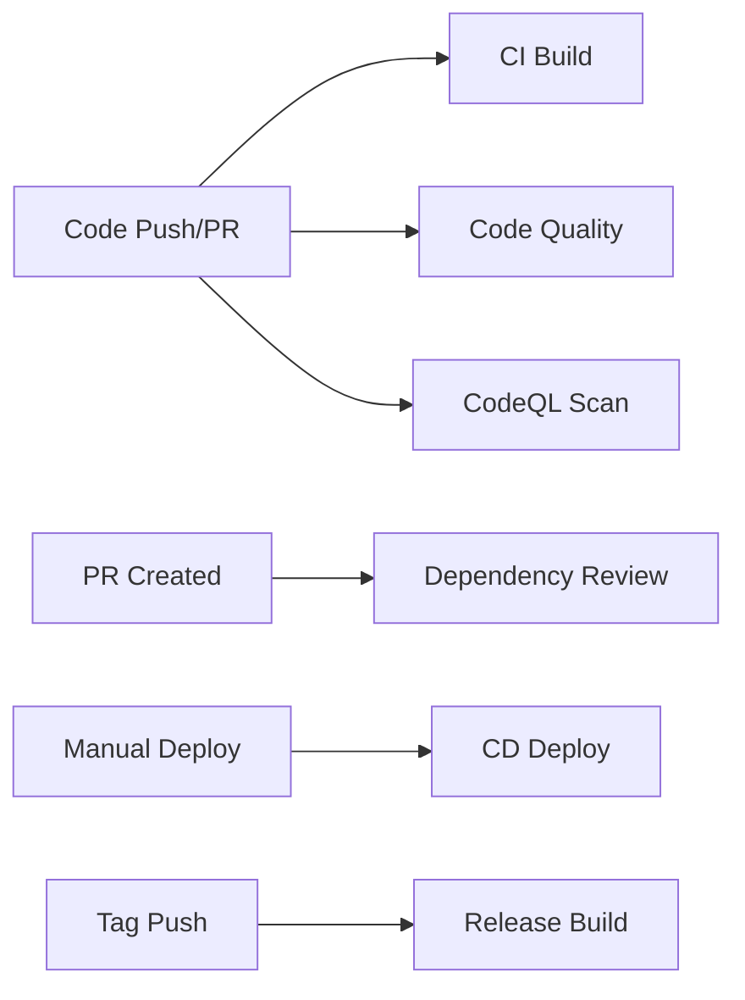

# HR Certificate Portal Backend (ASP.NET Core 8)

## Prerequisites
- .NET 8 SDK
- SQL Server (LocalDB is fine)  
- PowerShell (Windows)

## Configuration
- Edit `HrCertificatePortal.Api/appsettings.json`:
  - `ConnectionStrings:DefaultConnection` to point to your SQL Server
  - `Jwt` section: set a strong `Key`, and adjust `Issuer`/`Audience` if needed

## Restore & Build
```powershell
# From the backend root
dotnet restore .\HrCertificatePortal.Api\HrCertificatePortal.Api.csproj
dotnet build -c Release .\HrCertificatePortal.Api\HrCertificatePortal.Api.csproj
```

## Run Locally
```powershell
# Development run
 dotnet run --project .\HrCertificatePortal.Api\HrCertificatePortal.Api.csproj
```
The API will expose Swagger UI at `/swagger`.

## Database & Migrations
This project calls `EnsureCreated()` at startup for quick local development.
To use EF Core migrations instead:
```powershell
# Install dotnet-ef tool if needed
 dotnet tool install --global dotnet-ef

# Add initial migration
 dotnet ef migrations add InitialCreate --project .\HrCertificatePortal.Api\HrCertificatePortal.Api.csproj --startup-project .\HrCertificatePortal.Api\HrCertificatePortal.Api.csproj

# Apply migration
 dotnet ef database update --project .\HrCertificatePortal.Api\HrCertificatePortal.Api.csproj --startup-project .\HrCertificatePortal.Api\HrCertificatePortal.Api.csproj
```

## Default Seed Users
- Admin: `admin@example.com` / `Admin@123`
- Super Admin: `superadmin@example.com` / `Super@123`

Use `/api/auth/login` to obtain a JWT, then authorize in Swagger with `Bearer <token>`.

## CI/CD Pipeline

This project uses GitHub Actions for continuous integration and deployment.

### Available Workflows

#### 1. CI - Build and Test (`ci.yml`)
**Triggers:** Push/PR to `main` or `develop` branches, manual dispatch

**What it does:**
- Restores NuGet dependencies
- Builds the project in Release configuration
- Runs all tests (when available)
- Uploads build artifacts
- Generates build summary

**Status:** 

#### 2. Code Quality (`code-quality.yml`)
**Triggers:** Push/PR to `main` or `develop` branches, manual dispatch

**What it does:**
- Checks code formatting
- Runs static code analysis
- Verifies warning levels

**Status:** 

#### 3. CodeQL Security Scan (`codeql.yml`)
**Triggers:** Push/PR to `main` or `develop` branches, weekly schedule (Mondays), manual dispatch

**What it does:**
- Performs security vulnerability scanning
- Identifies potential security issues
- Runs quality checks

**Status:** 

#### 4. Dependency Review (`dependency-review.yml`)
**Triggers:** Pull requests to `main` or `develop` branches

**What it does:**
- Reviews dependency changes in PRs
- Flags vulnerable dependencies
- Posts results as PR comments

#### 5. CD - Deploy (`cd.yml`)
**Triggers:** Manual dispatch with environment selection

**What it does:**
- Builds and publishes the application
- Creates deployment package
- Prepares for Azure Web App deployment (configurable)
- Supports staging and production environments

**To deploy:**
```bash
# Go to Actions → CD - Deploy → Run workflow
# Select environment: staging or production
```

**Azure deployment setup:**
1. Configure GitHub Secrets:
   - `AZURE_WEBAPP_NAME`: Your Azure Web App name
   - `AZURE_WEBAPP_PUBLISH_PROFILE`: Publish profile from Azure Portal
2. Uncomment the Azure deployment step in `cd.yml`

#### 6. Release (`release.yml`)
**Triggers:** Push tags matching `v*.*.*` pattern, manual dispatch

**What it does:**
- Builds for multiple platforms (Linux x64, Windows x64)
- Creates release archives (.tar.gz, .zip)
- Generates changelog from commits
- Creates GitHub Release with artifacts

**To create a release:**
```bash
# Tag and push
git tag v1.0.0
git push origin v1.0.0

# Or manually trigger via Actions → Release → Run workflow
```

### Workflow Dependencies



### Security

- **CodeQL** runs on every push and weekly to catch security vulnerabilities
- **Dependency Review** checks PRs for vulnerable dependencies
- All workflows use pinned action versions for security

### Best Practices

1. **Before merging:** Ensure CI, Code Quality, and CodeQL checks pass
2. **Pull Requests:** Review dependency scan results
3. **Deployments:** Use staging environment first, then production
4. **Releases:** Use semantic versioning (v1.0.0, v1.0.1, etc.)

### Local Development Workflow

1. Create feature branch: `git checkout -b feature/my-feature`
2. Make changes and commit
3. Push and create PR
4. Automated checks will run
5. After review and approval, merge to develop/main
6. CI/CD pipeline handles the rest
